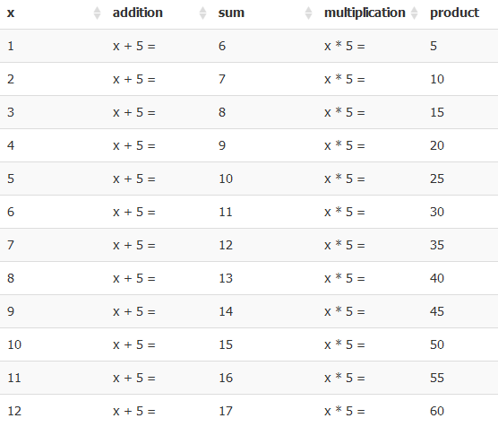
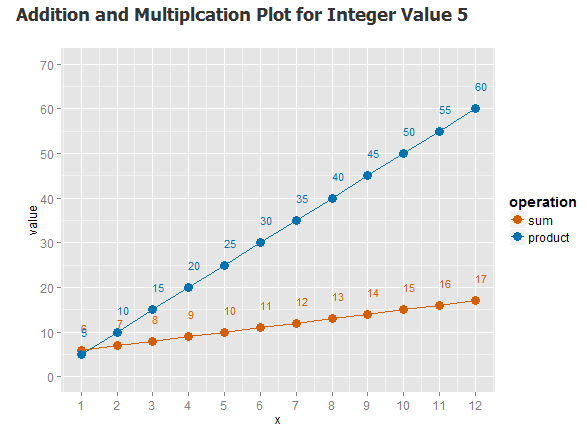

Math Fact App for Addition and Multiplication Tables and Plots   
========================================================
author: Brian Zive  
date: November 2014  


Description    
========================================================

This app produces addition and multiplication tables for integers 1 through 12.

- These are most common math facts taught to young grade school students.  
- Students become engaged in math by interacting with tables and plots on the computer! 
- A single fact table is produced for both addition and multiplication facts.  
- Plotting the values in a visually appealing graph allows the student to visually explore the absolute difference between addition and multiplication.  
- App available at http://busasquatch.shinyapps.io/MathApp  


Traditional Multiplication Table
========================================================  
Traditional fact tables are busy and cluttered.  
The student can lose track of columns and rows easily.  

```
     1  2  3  4  5  6  7  8   9  10  11  12
1*   1  2  3  4  5  6  7  8   9  10  11  12
2*   2  4  6  8 10 12 14 16  18  20  22  24
3*   3  6  9 12 15 18 21 24  27  30  33  36
4*   4  8 12 16 20 24 28 32  36  40  44  48
5*   5 10 15 20 25 30 35 40  45  50  55  60
6*   6 12 18 24 30 36 42 48  54  60  66  72
7*   7 14 21 28 35 42 49 56  63  70  77  84
8*   8 16 24 32 40 48 56 64  72  80  88  96
9*   9 18 27 36 45 54 63 72  81  90  99 108
10* 10 20 30 40 50 60 70 80  90 100 110 120
11* 11 22 33 44 55 66 77 88  99 110 121 132
12* 12 24 36 48 60 72 84 96 108 120 132 144
```
###### (Note, this matrix was produced with R code.)  


Math Fact App Tables   
========================================================  
  

*** 
- Our new table allows the student to focus on one factor at a time.   
- The student chooses which factor (s)he wants to see.
- The table can be produced for addition only, multiplication only, or both addition and multiplication (as shown).  
 

Math Fact App Plots  
========================================================

  
*** 
- Students can visually explore the change in values as the factor progresses through numbers 1 - 12.  
- Like the tables, the student chooses which factor (s)he wants to see.  
- Like the tables, the plot can be produced for addition only, multiplication only, or both addition and multiplication (as shown).  


